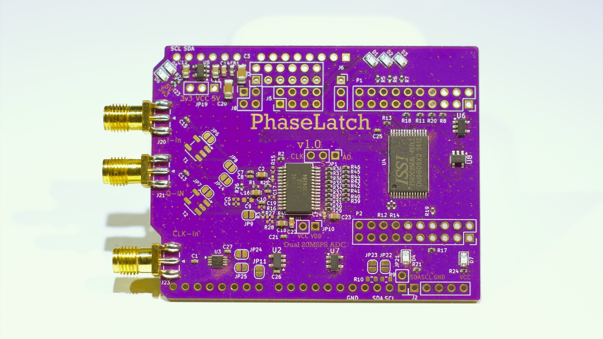

# PhaseLatch

PhaseLatch – 6502-Interfaced High-Speed ADC for Experimental SDR

PhaseLatch is an open-source hardware project that explores how far a classic MOS 6502-class CPU can be pushed into modern signal-processing territory. The board implements a dual-channel, 10-bit, 20 MSPS analog-to-digital converter with a straight binary parallel output, allowing the ADC to be memory-mapped directly onto a 6502 (8 bit) data bus.

Unlike typical SDR designs that rely on high-performance microcontrollers or FPGAs, PhaseLatch intentionally interfaces high-speed conversion hardware with a severely resource-constrained 8-bit CPU. This makes it a platform for experimenting with timing limits, bus contention, memory expansion, and minimalist DSP techniques such as Goertzel tone detection executed entirely on the 6502.

The board is designed as a modular Arduino-shield-style form factor and is intended to stack with the PhaseLoom IQ mixer and the 65uino 6502 system. Direct access to the CPU address, data, and control signals enables single-instruction ADC reads and deterministic sampling under software control.

PhaseLatch is not intended to achieve full theoretical ADC bandwidth on a 6502. Instead, it serves as a practical exploration of real-world limitations, architectural trade-offs, and creative signal-processing approaches on vintage computing hardware.

## Purchase

Interested in owning a PhaseLatch?  
[Buy one here](https://www.imania.dk/index.php?cPath=204&sort=5a&language=en).

## How to Use
[6502 source code still lives over on the 65uino project](https://github.com/AndersBNielsen/65uino/)

The main 65uino firmware currently comes with support for the PhaseLatch built in. Time of writing, use the SDR branch. 

To get the full bandwidth out of PhaseLatch, it can also be used with an **FX2LP** USB streaming board instead of the **65uino**.

## Software
The `software/` folder contains the USB streamer firmware + host-side tools for getting PhaseLatch data into SDR software.

- [software/README.md](software/README.md): Overview, build instructions, and a demo cheat sheet.
- [software/firmware/](software/firmware/): FX2/FX2LP firmware (USB streaming).
- [software/host/](software/host/): Host utilities (USB reader, format conversion, DC / IQ correction).
- [software/examples/](software/examples/): Example pipelines (including streaming to `/tmp/iq.fifo` for Gqrx).
- [software/doc/](software/doc/): Notes on wiring and rate planning.

## Using with an FX2LP (USB streaming)
PhaseLatch includes header footprints intended for wiring to an **FX2LP** dev board. The FX2LP provides USB 2.0 high‑speed bulk streaming and acts as the “bridge” from the ADC to a host PC.

At a high level the flow is:
- FX2LP firmware streams raw samples over USB
- host reads via libusb and converts to CF32
- stream is written to `/tmp/iq.fifo` so **Gqrx** can open it

Start with the guide in `software/README.md`, then use `software/examples/pipeline.sh` for a one-command stream to `/tmp/iq.fifo`.

## Getting a PCB

## Production & Manufacturing
- The `jlcpcb/gerber/` folder contains all necessary files for PCB fabrication.
- The `production_files/` folder includes:
  - `BOM-PhaseLatch.csv`: Bill of Materials
  - `CPL-PhaseLatch.csv`: Component Placement List
  - `GERBER-PhaseLatch.zip`: Zipped Gerber files for easy upload

This project is kindly sponsored by JLCPCB. They offer cheap, professional looking PCBs and super fast delivery.

Step 1: Get the gerber file zip package from the /hardware folder

Step 2: Upload to JLCPCB [https://jlcpcb.com/?from=Anders_N](https://jlcpcb.com/?from=Anders_N)

Step 3: Pick your color, surface finish and order.

You can use these affiliate links to get a board for $2 and also get $54 worth of New User Coupons at: https://jlcpcb.com/?from=Anders_N

And in case you also want to order a 3D-printed case you can use this link. 
How to Get a $7 3D Printing Coupon: [https://3d.jlcpcb.com/?from=Anders3DP](https://jlc3dp.com/?from=Anders_N)

---

For more details, technical explanations, and the full story behind PhaseLoom, check out the project video and documentation. Special thanks to JLCPCB and Fnirsi for supporting the development of this project!

